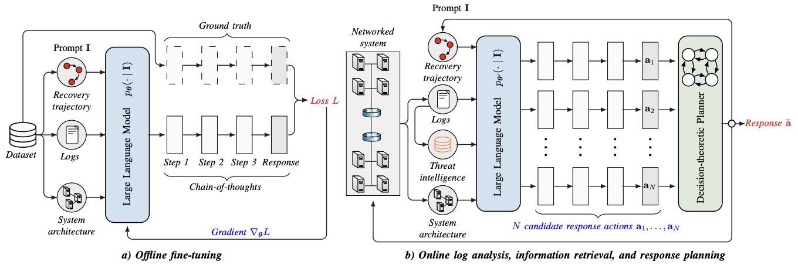

# Incident Response Planning Using a Lightweight Large Language Model with Reduced Hallucination

This repository contains the artifacts related to the paper *"Incident Response Planning Using a Lightweight Large Language Model with Reduced Hallucination"*, which is conditionally accepted to The Network and Distributed System Security (NDSS) Symposium 2026. 
We introduce a novel method that enables the effective use of a large language model (LLM) to provide decision support for incident response planning. Our method uses the LLM for translating system logs into effective response plans while addressing its limitations through fine-tuning, information retrieval, and decision-theoretic planning. Unlike prior work, which relies on prompt engineering of frontier models, our method is lightweight and can run on commodity hardware.

Our artifacts include: 
- The first public fine-tuning dataset of incidents and response actions. This is the dataset we use to produce the results in the paper. The dataset can be downloaded [here](https://huggingface.co/datasets/kimhammar/CSLE-IncidentResponse-V1)
- The weights of the fine-tuned model, which can be downloaded [here](https://huggingface.co/kimhammar/LLMIncidentResponse)
- Python code for downloading the training dataset (`load_training_dataset.py`).
- Python code for downloading the fine-tuned model and using it to generate an incident response plan (`load_fine_tuned_llm.py`).
- Python code for generating an incident response plan (`response_generation.py`).
- Python code for fine-tuning a new model based on our dataset (`fine_tune_llm.py`).

<p align="center">

</p>

# Requirements

- Python 3.8+
- `load_training_dataset.py` requires 1 GB of storage and a commodity CPU.
- `load_fine_tuned_llm.py`: requires 15 GB of storage and a commodity CPU.
- `response_generation.py`: requires a commodity GPU, e.g., an RTX 8000.
- `fine_tune_llm.py`: requires a commodity GPU, e.g., an RTX 8000.

We have tested the Python scripts on the following platforms: 

- MacOs Sequoia with Python 3.9.
- Ubuntu 22.04 with Python 3.9.

# Installation

To install the required python libraries, run the following command:
```bash
pip install llm_recovery==0.0.6
```

# Execution 

## Loading the fine-tuned LLM

Command:
```bash
python load_fine_tuned_llm.py 
```

Expected output:
```bash
TODO
```

## Loading the fine-tuning dataset

Command:
```bash
python load_training_dataset.py
```

Expected output:
```bash
TODO
```

## Response generation

Command:
```bash
python response_generation.py
```

Expected output:
```bash
TODO
```

## Fine-tuning X on our dataset

Command:
```bash
python fine_tune_llm.py
```

Expected output:
```bash
TODO
```


## Authors

Kim Hamar, Tansu Alpcan, and Emil Lupu. 

Contact: kimham@kth.se

## 🔖 Copyright and license

<p>
<a href="./LICENSE.md">Creative Commons (C) 2025, Kim Hammar, Tansu Alpcan, and Emil Lupu</a>
</p>

<p align="center">

</p>

<p align="center">


</p>

---
<p align="center" style="align-items:center; display:inline-block">
Made with &#10084; &nbsp;
at &nbsp; <a href="https://www.kth.se/" target="_blank">

</a>
&nbsp; and 
&nbsp;<a href="https://www.kth.se/cdis" target="_blank">

</a>
</p>
